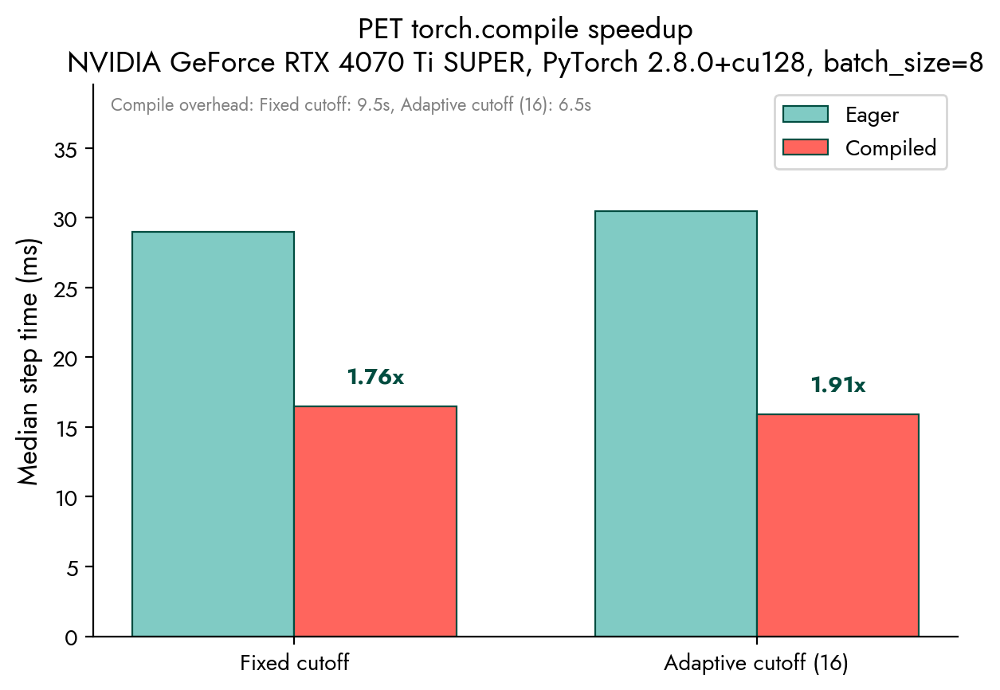
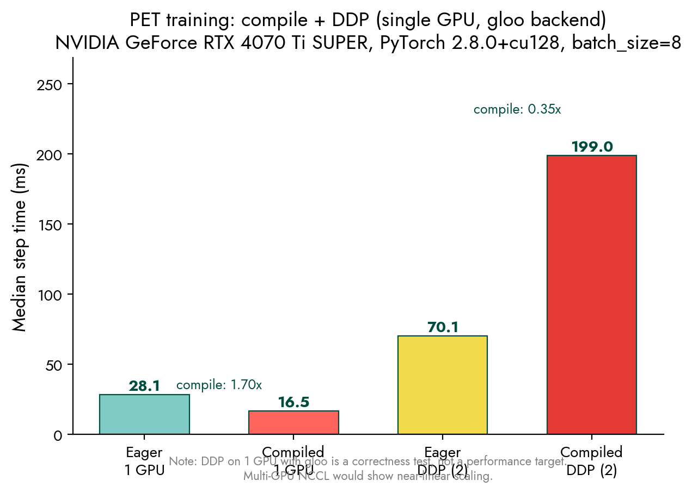

#+TITLE: PET Compile + DDP Benchmarks
#+DATE: 2026-03-15

* Overview

Benchmarks for PET full-graph FX compilation (=torch.compile=) vs eager mode,
with and without DDP (DistributedDataParallel).

Compares per-step wall-clock time for the compiled training path against the
default eager path, measuring compilation overhead and steady-state speedup.

* Running

From the pixi_envs metatrain workspace root:

#+BEGIN_SRC shell
cd pixi_envs/orgs/metatensor/metatrain

# All benchmarks + plots
bash pet_bench/run_benchmarks.sh

# Compile benchmark only
bash pet_bench/run_benchmarks.sh --compile-only

# DDP benchmark only (needs CUDA)
bash pet_bench/run_benchmarks.sh --ddp-only

# Regenerate plots from existing results
bash pet_bench/run_benchmarks.sh --plot-only
#+END_SRC

Or run individual scripts:

#+BEGIN_SRC shell
# Compile: eager vs compiled, fixed + adaptive cutoff
pixi run uv run --project metatrain --extra pet \
  python pet_bench/bench_compile.py --steps 50 --output pet_bench/results/bench_compile.json

# DDP: 4 configs (eager/compiled x single/DDP)
pixi run uv run --project metatrain --extra pet \
  python pet_bench/bench_ddp.py --steps 30 --output pet_bench/results/bench_ddp.json

# Plots
pixi run uv run --project metatrain --extra pet --with matplotlib \
  python pet_bench/plot_benchmarks.py \
    --compile pet_bench/results/bench_compile.json \
    --ddp pet_bench/results/bench_ddp.json \
    --output-dir pet_bench/plots
#+END_SRC

* What It Measures

** Compile benchmark (=bench_compile.py=)

- *Eager mode*: Standard PET training via =evaluate_model()= with
  =is_training=True= (forces/stress via double backward).
- *Compiled mode*: Full-graph FX compilation via =compile_pet_model()=
  which traces the entire forward + force/stress into a single graph
  and compiles with =torch.compile(dynamic=True, fullgraph=True)=.

Two cutoff configurations: fixed (4.5 A) and adaptive (16 neighbors).
50 steps after warmup, reports median/mean/std/min/max.

** DDP benchmark (=bench_ddp.py=)

Four configurations on a single GPU with gloo backend:
1. Eager single-GPU (baseline)
2. Compiled single-GPU
3. Eager DDP (2 ranks)
4. Compiled DDP (2 ranks)

Note: DDP on 1 GPU with gloo is a *correctness test*, not a performance
target. Multi-GPU NCCL would show near-linear scaling. The benchmark exists
to verify the DDP path works and to measure overhead.

* Configuration

Default PET hyperparameters (2.9M params), =qm9_reduced_100.xyz= (100
structures, batch_size=8). Energy target with forces and stress gradients.

* Reference Results

** RTX 4070 Ti SUPER (SM 8.9, 16 GB, PyTorch 2.8.0+cu128)

*** Compile speedup

| Config             | Eager (ms) | Compiled (ms) | Speedup | Compile overhead |
|--------------------+------------+---------------+---------+------------------|
| Fixed cutoff       |       29.0 |          16.5 |  1.76x  | 9.5 s            |
| Adaptive cutoff    |       30.5 |          15.9 |  1.91x  | 6.5 s            |

#+ATTR_ORG: :width 600

*** DDP (single GPU, gloo backend)

| Config          | Median (ms) | vs Eager 1GPU |
|-----------------+-------------+---------------|
| Eager 1 GPU     |        28.1 | baseline      |
| Compiled 1 GPU  |        16.5 | 1.70x faster  |
| Eager DDP (2)   |        70.1 | 0.40x (gloo)  |
| Compiled DDP (2)|       199.0 | 0.14x (gloo)  |

DDP overhead on single-GPU gloo is expected. On multi-GPU NCCL, the
communication-to-compute ratio would be much more favorable.

#+ATTR_ORG: :width 600

* File layout

#+BEGIN_SRC
pet_bench/
  bench_compile.py       # compile benchmark script
  bench_ddp.py           # DDP benchmark script
  plot_benchmarks.py     # plotting (matplotlib)
  run_benchmarks.sh      # one-shot runner
  readme.org             # this file
  results/               # JSON output from benchmarks
    bench_compile.json
    bench_ddp.json
  plots/                 # generated PNG plots
    compile_speedup.png
    ddp_compile_comparison.png
#+END_SRC
